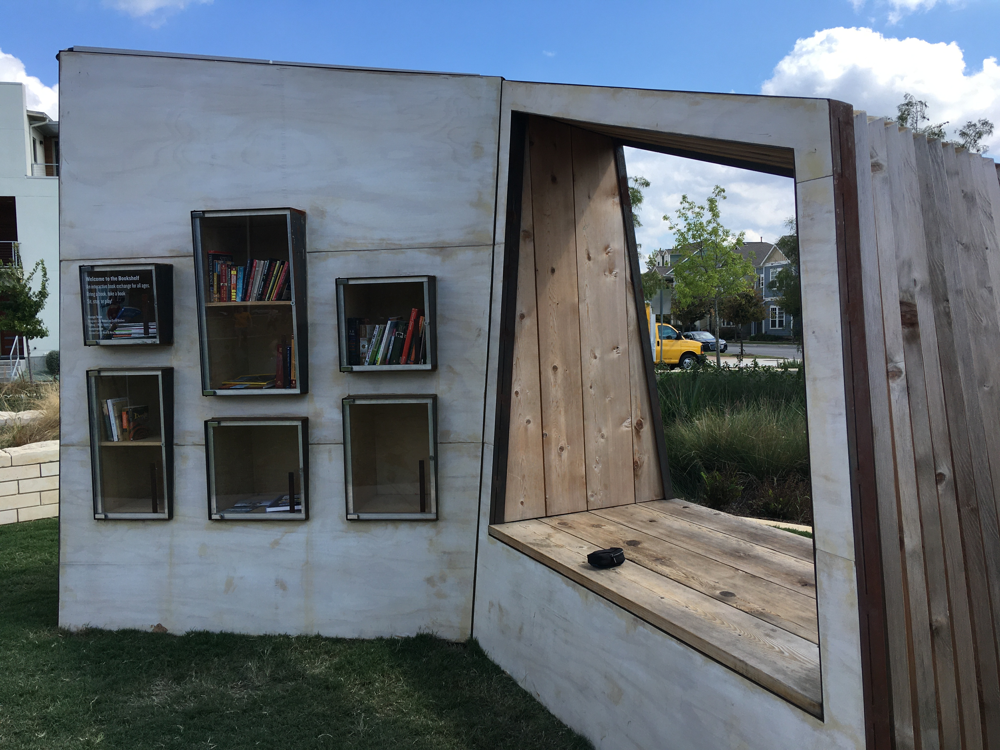
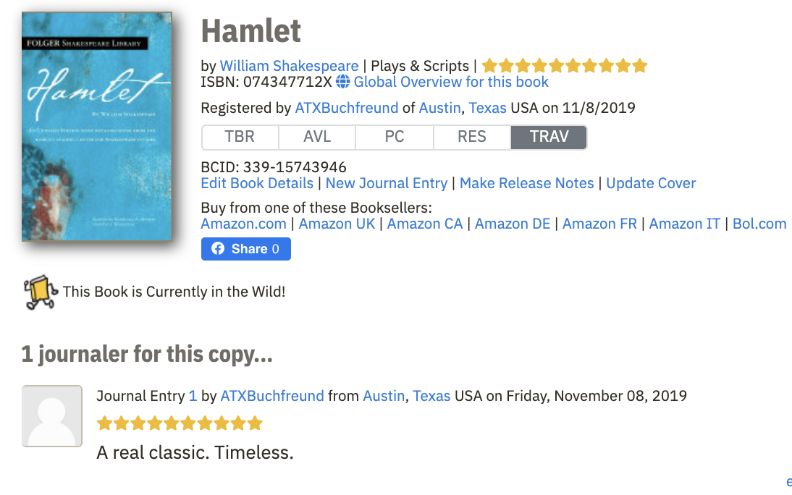
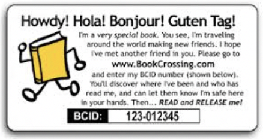
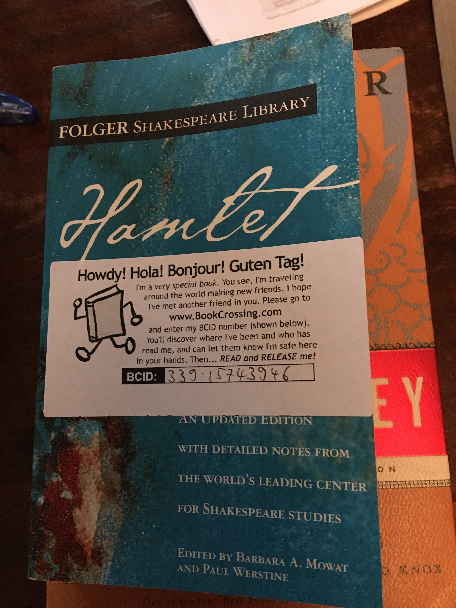

```{r setup, include=FALSE}
knitr::opts_chunk$set(echo = FALSE)
```

## What did I expect when I participated?

- Tracking information 
- Reviews of the books
- Books to read
- Smooth process
- Sense of community and connection\ 
\
\
\
&nbsp;  &nbsp;  &nbsp;  &nbsp;  &nbsp; &nbsp;  &nbsp;
              <a href="https://www.bookcrossing.com/">
                    </a>
                    
                    
                    
                                

## What did I do?
&nbsp;  &nbsp;  &nbsp;  &nbsp;&nbsp;{#id .class width=300 height=200px}\
- Sent out 23 books and wrote journal entries for each  
- Caught 1 book  
- Solved one technical problem with the online support  

{#id .class width=300 height=200px}
&nbsp;  &nbsp;  &nbsp;  {#id .class width=150 height=100px}
&nbsp;  &nbsp;  &nbsp;  {#id .class width=100 height=150px}\


## BookCrossing Release Diagram (Oct.- Nov. 2019)

```{r, echo = FALSE}
DiagrammeR::mermaid("
graph LR
A[23 Registered Books] --> B[2 Controlled Releases]
B --> C[Friend: 1 Book]
B --> D[Wisher: 1 Book]
A --> E[21 Wild Releases]
E --> F[The BookShelf Free Little Library Bookzone: 8 Books]
E --> G[Speedway Free Little Library: 3 Books]
E --> H[Avenue F Free Little Library: 3 Books]
E --> I[AHS Free Little Library: 1 Book]
E --> J[Avenue C Free Little Library: 5 Books]
E --> K[Tom Miller Free Little Library Bookzone: 1 Book]
", height = 550)
```

## Reactions to Book Releases and Caught books

Release kind  |  Number  |  Journal Entry  | Happiness
------------- | -------- | --------------- | ---------
Gen LL        | 13       |        0        |  😕
The Bookshelf |  8       |        1        |  😐
Friend        |  1       |        2        |  🙂
Wisher        |  1       |        1        |  😐

Place caught  |  Number  |  Journal Entry  | Happiness
------------- | -------- | --------------- | ----------
The Bookshelf |  1       |        1        |  🙂

## How were my expectations met?

- Almost no tracking information 
-	Only 1 review (from my friend)
-	Only 1 book caught (could not find more)
-	Very smooth process
-	A sense of community and connection \
\


{#id .class width=300 height=200px}


