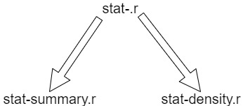

```{r setup, include=FALSE}
knitr::opts_chunk$set(echo = FALSE)
```

## Definitions

- **ggplot2:** Data Visualization Package from Tidyverse.
- **Tidyverse:** collection of specialized R Packages.
- **Package:** a bundle of code, data, documentation, & tests to share with others [@wickham_r_2015].
- Each function & function family has an R Script.



## First Attempt: Contributing Code

<div class = "columns-2">

- **Issue:** Using `position_dodge` functions in dumbbell graphs.
- Lines use `x` and `xend` points, only `x` moved.
- Other `position` functions work, but `dodge` does not.
- Needed specific tools to develop R Packages.

```{r, echo = FALSE, message = FALSE, fig.height = 3, fig.width = 4}
library(tidyverse)
set.seed(1234)

df <- tibble(
    group = rep(letters[1:3], each = 2),
    subgroup = rep(c("A", "B"), 3)
  ) %>%
  mutate(
    start = rpois(6, 10),
    end = start + rpois(6, 3)
  )

ggplot(df) +
  geom_point(
    aes(group, start, color = subgroup),
    position = position_dodge(width = 1)
  ) +
  geom_point(
    aes(group, end, color = subgroup),
    position = position_dodge(width = 1)
  ) +
  geom_segment(
    aes(x = group, xend = group, y = start, yend = end, color = subgroup),
    position = position_dodge(width = 1)
  ) +
  coord_flip()
```
Posted by Chris Wilke [-@wilke_position_dodge_2019].

</div>

## Second Attempt: Contributing Documentation

Add information to theme-defaults.r [@wickham_document_2019].

```{r, echo = TRUE}
#' @param base_size base font size
#' @param base_family base font family
#' @param base_line_size base size for line elements
#' @param base_rect_size base size for rect elements
```
Original (above); Submission (below)
```{r, echo = TRUE}
#' @param base_size Base font size, in points. Unlike `geom_label` 
#' and others, the default unit is in `points`, not `mm`, so adding 
#' `.pt` is not needed.
#' @param base_family Base font family.
#' @param base_line_size Base size for line elements, in mm.
#' @param base_rect_size Base size for rect elements, in mm.
```

## References

