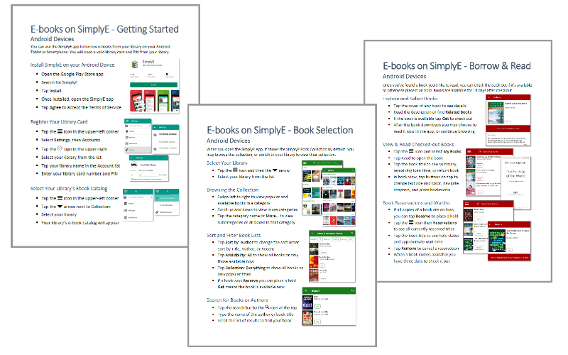
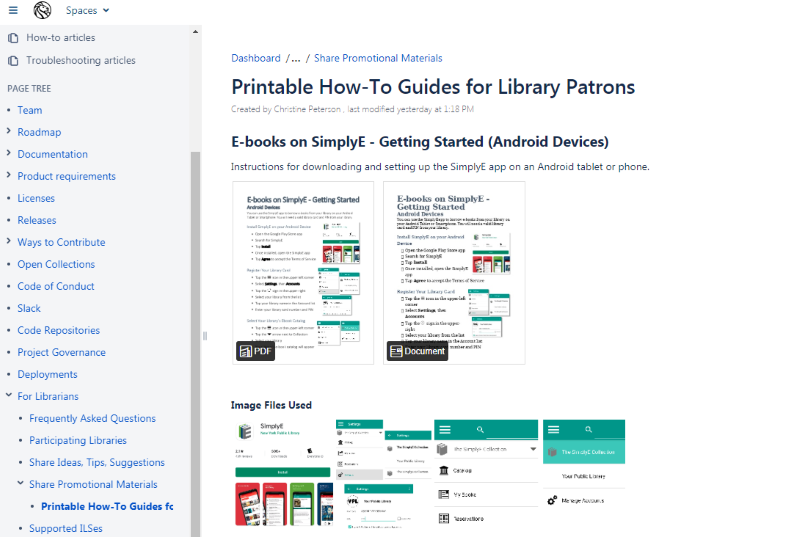

```{r setup, include=FALSE}
knitr::opts_chunk$set(echo = FALSE)
```

## SimplyE: Open Source E-Reader App
<div class="columns-2">


&nbsp;

&nbsp;

&nbsp;

- Created by the New York Public Library
- Open Source eReader Platform
- Supports eBooks and eAudiobooks
- Vendor Neutral 

</div>

## Vendor E-Reader Platforms


## Making a Contribution

### Contribution Points

- GitHub: Codebase
- Confluence: Documentation Wiki

### Particular Needs

- Non-Technical Documentation
- Promotional Materials


# And then...the waiting....

## The Dang Thing is Broken
<div class="centered">


  


</div>


# But Everything Worked Out In The End

## How-To Guides


## Updating the Wiki



# Thoughts?