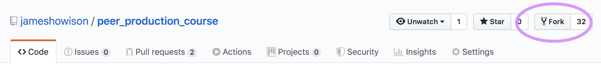
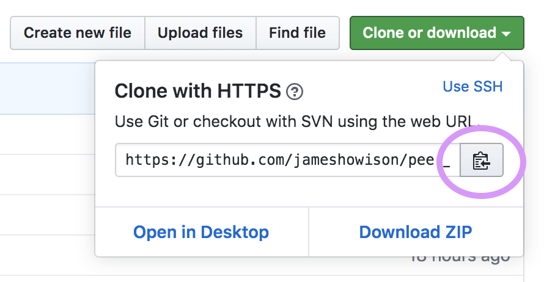

```{css, echo=FALSE}
.spoiler {
  visibility: hidden;
}

.spoiler::before {
  visibility: visible;
  content: "Take a Hint: Hover me to see the command."
}

.spoiler:hover {
  visibility: visible;
}

.spoiler:hover::before {
  display: none;
}
```


Exercises done in groups of three.  Incidentally [George Simmel](http://socio.ch/sim/work.htm) in early 20th century says that everything changes when you go from 1 to 2 people (a dyad), and then again going from 2 to 3 (a triad). He said that because at 3 people it's the first time you can be outvoted :) Check it out.

**Arrange your chairs so that you can see each other's screens. That means sitting kinda back to back, which is unnatural but you do want to easily see what each other are seeing**

# Vizualizer

Access the [LearnGitBranching vizualizer](https://learngitbranching.js.org/?NODEMO) or the [github vizualizer for pretty branching diagrams](https://git-school.github.io/visualizing-git/).

# Cheatsheet picture


# Basic forking workflow setup.

1. Group of three: *Maintainer*, *Contributor A*, *Contributor B*.

2. *Maintainer* creates new repository on github.

3. *Contributor A* and *Contributor B* log into github, find the new repository created by *Maintainer* and fork it.



4. *Maintainer*, *Contributor A*, *Contributor B* should all clone their individual repo to their laptop.  Everyone will have their own username in the URL.  You can quickly copy that with this button on github.



Before running git clone, everyone needs to ensure they are in a folder that is not inside another repo. To do this run `git status` and you *want* to see a fatal error.

```sh
git status
```
```
fatal: Not a git repository (or any of the parent directories): .git
```

If you do not see the fatal error, then you need to move up in your folder hierarchy until you are not in a repo.  Use `cd ..`.

Then clone your repository and change directory into it.

<div class="spoiler">
```sh
$ git clone <fork_repo_url>
$ cd <repository_name>
```
</div>

5. Establish remotes.  *Maintainer* does not need to do this, since they have directly cloned the shared repository. *Contributor A* and *Contributor B* will specify the shared repository as "upstream". 

<div class="spoiler">
```sh
$ git remote add upstream <maintainers_repo_url>
```
</div>

If setup properly then the `git remote -v` command will show two lines for *Maintainer*, but four lines for *Contributor A* and *Contributor B*:

*Maintainer*

```sh
git remote -v
```
```
origin	<fork_repo_url> (fetch)
origin	<fork_repo_url> (push)
```

*Contributor A* and *Contributor B*:

```sh
git remote -v
```
```
origin	<fork_repo_url> (fetch)
origin	<fork_repo_url> (push)
upstream <maintainers_repo_url> (fetch)
upstream <maintainers_repo_url> (push)
```

Note that git automatically creates the `origin` remote as whatever URL was used with `git clone`. This has the odd implication that for the *Maintainer* their `origin` is the shared repository, while for *Contributor A* and *Contributor B* their `origin` is their individual forks.

Each exercise below assumes this setup in [Basic forking workflow setup](#basic_forking_workflow_setup) as the starting point.

# Sharing work and synchronizing

Now we are going to use `git push` and Github Pull Requests, followed by `git pull` to collect work from *Maintainer*, *Contributor A*, *Contributor B* and  in the shared repo, then synchronize so that everyone has a local copy of everyone's work.

1. *Maintainer*, *Contributor A*, *Contributor B* each create a file named after their role (ie maintainer.txt, contributorA.txt, contributorB.txt). Use whichever editor you like (e.g., `vi`, Atom, Rstudio, etc.)

2. Add and commit your new file.

<div class="spoiler">
```sh
git add <your_new_file>
git commit -m "Contributing a file"
```
</div>

3. Push your new file. By default git push uses `origin` as the destination.

<div class="spoiler">
```sh
git push
```
</div>

For *Maintainer* the file has gone directly into the shared repo. For *Contributor A* and *Contributor B* these files are now at their fork, and will need a Pull Request to move to the shared repo.

4. *Contributor A* and *Contributor B* go to github and look at their own fork. Github knows that the fork now has material that the shared repo doesn't, and will make a New Pull Request button available.


Since we created files with unique file names, these PRs will show up as "Able to be automatically merged".

5. The *Maintainer* should now see a number next to the Pull Request tab:


The *Maintainer* can accept both pull requests, which will merge files into the shared repo.

Now each person needs to synchronize with the shared repo, bringing the new files from the other two group members into their local repo. This uses the `pull` command.

6. *Contributor A* and *Contributor B* should pull upstream.

<div class="spoiler">
```sh
git pull upstream master
```
</div>

But *Maintainer* is pulling from their `origin`, so can use the default

<div class="spoiler">
```sh
git pull
```
</div>

7. Finally, *Contributor A* and *Contributor B* will push these new changes from the shared repo up to their forks.

<div class="spoiler">
```sh
git push
```
</div>

I've always thought it is a little strange that a contributor's fork doesn't distribute changes from upstream, but that new work from the shared repo gets to the fork via the contributor's local repo on their laptop.  After all, github knows the fork is connected to the shared repo ... but this is the roundabout way it works.

# Generate merge conflict

(If starting here, confirm that your Group of three has the setup in [Basic forking workflow setup](#basic_forking_workflow_setup) as the starting point.)

The point of this exercise is to intentionall create conflicts in editing, to demonstrate how they show up in Pull Requests.

1. *Maintainer* should pick (or create) a repository on github as the shared/upstream repository, and work with an up to date clone. Create, add, commit, and push a file called `animals.txt` with this content:
```
lion
tiger
leopard
turtle
```

3. *Contributor A* and *Contributor B* should synchronize to receive this file.

<div class="spoiler">
```sh
git pull upstream master
```
</div>

4. *Contributor A* and *Contributor B* each edit the file by adding a different color to the first line in the `animals.txt` (so it reads `lion red` or `lion green`). They add, commit, push to their forks. *Note that these edits are incompatible, so they will generate a conflict when we try to merge them below*

4. *Contributor A* and *Contributor B* should then go to github and look at their forks.  They should create a pull request by hitting the 'New Pull Request' button. Note that the pull request will not say "Able to automatically merge" but create the PR anyway.

5. With everyone looking at *Maintainer*'s computer, *Maintainer* should refresh the github page for the shared repository and will see two pull-requests in the pull-request tab. Accept each one, resolving any conflicts that emerge. 

They can choose whatever contributions they want (the original line, the line with the color from *Contributor B* or the line with the color from *Contributor A*); however the file is after removing the `<<<<<` `========` and `>>>>>>` lines will be what is in the shared repository.

6. Each person should then synchronize. For *Maintainer* that just means `git pull` (since they have a direct clone of upstream). For *Contributor B* and *Contributor A* they have to first get the changes in upstream, then push them to their fork.

<div class="spoiler">
```sh
$ git pull upstream master
$ git push
```
</div>

# Upstream owner contributes via pull request

When you own a repository (ie you clone something other than a fork), you sometimes want to make contributions via a pull request rather than directly pushing. This allows others to inspect, discuss, review, even the owner's contributions and increases transparency.

You do this by working with a branch then making a pull request from that branch to master all inside the same repo (rather than from a branch on a fork). This is just really the same advice as for others: always use a (short lived) feature branch for your contributions, so the owner on an upstream repo generally shouldn't push directly to master.

1. On local, create a branch (`for-pull-request`)

<div class="spoiler">
```sh
$ git checkout -b for-pull-request
Switched to a new branch 'for-pull-request'
```
</div>

2. Edit a file, add, commit.

<div class="spoiler">
```sh
$ nano README.md
$ git add README.md
$ git commit -m "Edit to send via pull request"
```
</div>

3. Push the branch to origin (`git push` will fail but the error message will show you a command that will run).

<div class="spoiler">
```sh
$ git push
fatal: The current branch for-pull-request has no upstream branch.
To push the current branch and set the remote as upstream, use

    git push --set-upstream origin for-pull-request
$git push --set-upstream origin for-pull-request
Total 0 (delta 0), reused 0 (delta 0)
remote: 
remote: Create a pull request for 'for-pull-request' on GitHub by visiting:
remote:      https://github.com/jameshowison/pp2019_pr_owner/pull/new/for-pull-request
remote: 
To https://github.com/jameshowison/pp2019_pr_owner.git
 * [new branch]      for-pull-request -> for-pull-request
Branch for-pull-request set up to track remote branch for-pull-request from origin.
```
</div>

4. On github, looking at the branch (by choosing it from drop down mentu), open a PR.

<div class="spoiler">


</div>

5. Accept the PR on github.

<div class="spoiler">

</div>

6. Back on local, switch to master.

<div class="spoiler">
```sh
$ git checkout master
Switched to branch 'master'
Your branch is up-to-date with 'origin/master'.
```
</div>

(Note that I think that up-to-date message is wrong because branch is behind master, hence being able to pull things, if anyone knows what's up there please tell me!)

7. Pull changes.
<div class="spoiler">
```sh
$ git pull
remote: Enumerating objects: 1, done.
remote: Counting objects: 100% (1/1), done.
remote: Total 1 (delta 0), reused 0 (delta 0), pack-reused 0
Unpacking objects: 100% (1/1), done.
From https://github.com/jameshowison/pp2019_pr_owner
   36cd034..6d0673d  master     -> origin/master
Updating 36cd034..6d0673d
Fast-forward
 README.md | 1 +
 1 file changed, 1 insertion(+)
$ git status
On branch master
Your branch is up-to-date with 'origin/master'.

nothing to commit, working tree clean
```
</div>

8. Delete the branch locally and on github

<div class="spoiler">
```sh
$ git branch -d for-pull-request
Deleted branch for-pull-request (was 01541c3).
$git push origin --delete for-pull-request
To https://github.com/jameshowison/pp2019_pr_owner.git
 - [deleted]         for-pull-request
```


# Tags

Tags help identify important points in the version history.  They are also used for releases on github.

Your task is to create three tags, `tag-animals`, `tag-colors`, `tag-noises` which reflect the merge points of different branches.

1. Have *Maintainer* create a repository, and start with the file having only animals.
2. *Maintainer* tag repo with `tag-animals`
3. *Contributor A* create a branch `colors-for-tag`. *Contributor B* and *Maintainer* contribute to that branch (`lion yellow`) via pull requests.
4. *Contributor A* merge `colors-for-tag` branch to master, than tag master as `tag-colors`.
5. *Contributor B* create branch `noises-for-tag`. *Contributor A* and *Maintainer* contribute to that branch as well. (`lion yellow roar`)
6. *Contributor B* merges that branch to master, then tag master as `tag-noises`. Others update.

Look at the history via `git log`:

```sh
git log --oneline --abbrev-commit --all --graph --decorate --color
```

# Split a pull request

Here the scenario is that you've created a pull request but it hasn't yet been accepted. 

If you add additional commits to that branch then they will get added to the pull request. Remember, a pull request says, "Please come to this repo and get everything on this branch." So it's not the same as puttings some commits in a zip file and mailing them, it's more like puttings things into a pigeonhole mail box and telling people to pick them up from there. 

So you can always add additional things before the person comes to pick them up. This is useful because if there is a conversation around the pull request then you can easily update things. For example, if someone said “Please fix a typo or pull from upstream before we consider your pull request,” you'd be able to do so without opening another PR (just add, commit, push to your branch on your fork and the PR is updated).

However, it is an issue if you *accidentally* add new commits to a branch before a pull request is accepted. Now your pull request has two sets of commits: the first set you meant to include and the second set you didn't. This mistake is particularly easy to make if you are developing on the `master` branch in your fork (which you shouldn't do), but also happens if you are have more than one contribution that you are working on, as when you are doing something else while waiting for a PR to be accepted.  If you’ve accidentally added too many files to your pull request—something that is easy to do if you use `git add *` or some variant—you'll also find yourself needing to remove content from your PR.

## Split before submit

Things would be better if you had created a new branch for the first set of commits, then a second branch for your second set of commits, never adding either set to your master branch and following the "always work on a (short-lived) feature branch" rule. Then each set of commits would be "sent" through a different pull request.

```
        / Branch for first set.
       /
master -
        \
         \ Branch for second set
```

The grey sections below are commands, the white is output.
```sh
This is a git command that you should copy
```
```
This is output.
```


Below, I make a new repo, create a README file and make a commit, and edit it once making another commit:

```sh
git init
```
```
Initialized empty Git repository in /Users/howison/Documents/UTexas/Courses/PeerProduction/practice/.git/
```
```sh
touch README
```
```sh
git add README
```
```sh
git commit -m "Adding readme"
```
```
[master (root-commit) d5eb1e8] Adding readme
 1 file changed, 1 insertion(+)
 create mode 100644 README
```
```sh
git log --oneline --abbrev-commit --all --graph --decorate --color
```
```
* d5eb1e8 (HEAD -> master) Adding readme
```

So now we have a single commit on a single branch `master`.  To create a new file we can use `touch` (which creates an empty file here, but that's ok).

```sh
touch master2
```
```sh
git add master2
```
```sh
git commit -m "add master2"
```
```
[master 749454e] add master2
 1 file changed, 2 insertions(+)
git log --oneline --abbrev-commit --all --graph --decorate --color
* 749454e (HEAD -> master) add master2
* d5eb1e8 Adding readme
```

Now we have added a commit on `master` so the `HEAD -> master` shows the 'tip' of the master branch.

Now we can create the feature branch (`first_set_branch`) for the first set and look at the commits we've made. Using `git checkout` with `-b` creates a new branch:

```sh
git checkout -b first_set_branch
```
```
Switched to a new branch 'first_set_branch'
```
```sh
touch first_set_file
```
```sh
git add first_set_file
```
```sh
git commit -m "first set edit"
```
```
[first_set_branch d71ade9] first set edit
 1 file changed, 1 insertion(+)
 create mode 100644 first_set_file
```
```sh
git log --oneline --abbrev-commit --all --graph --decorate --color
```
```
* d71ade9 (HEAD -> first_set_branch) first set edit
* 749454e (master) add master2
* d5eb1e8 Adding readme
```

Now we can see that we have two branches `(master)` and `first_set_branch`. `HEAD` shows us that we are currently in the `first_set_branch` branch.

Now we're going to change back to master.

```sh
git checkout master
```
```
Switched to branch 'master'
```
```sh
git log --oneline --abbrev-commit --all --graph --decorate --color
```
```
* d71ade9 (first_set_branch) first set edit
* 749454e (HEAD -> master) add master2
* d5eb1e8 Adding readme
```

See how the `HEAD` changed, showing us that we're looking at the master branch.  Notice also that there is a commit (`d71ade9`) that isn't in `master`.  

Now we can create the second branch:

```sh
git checkout -b second_set_branch
```
```
Switched to a new branch 'second_set_branch'
```
```sh
touch second_set_file
```
```sh
git add second_set_file
```
```sh
git commit -m "first edit in second set"
```
```
[second_set_branch 9dc0a23] first edit in second set
 1 file changed, 1 insertion(+)
 create mode 100644 second_set_file
```
```sh
git log --oneline --abbrev-commit --all --graph --decorate --color
```
```
* 9dc0a23 (HEAD -> second_set_branch) first edit in second set
| * d71ade9 (first_set_branch) first set edit
|/  
* 749454e (master) add master2
* d5eb1e8 Adding readme
```

Now the visualization has changed a bit. We can see that there are two branches that "come off" head after `749454e`. We can work independently, and could create pull requests for each branch separately. We are still on the second set's branch, let’s add a second file to it:

```sh
touch second_set_file2
```
```sh
git add second_set_file2
```
```sh
git commit -m "added to second set"
```
```
[second_set_branch 04d6967] added to second set
 1 file changed, 1 insertion(+)
 create mode 100644 second_set_file2
```
```sh
git log --oneline --abbrev-commit --all --graph --decorate --color
```
```
* 04d6967 (HEAD -> second_set_branch) added to second set
* 9dc0a23 first edit in second set
| * d71ade9 (first_set_branch) first set edit
|/  
* 749454e (master) add master2
* d5eb1e8 Adding readme
```

And just for fun swap back to the first branch and add a second file there:

```sh
git checkout first_set_branch
```
```
Switched to branch 'first_set_branch'
git log --oneline --abbrev-commit --all --graph --decorate --color
* 04d6967 (second_set_branch) added to second set
* 9dc0a23 first edit in second set
| * d71ade9 (HEAD -> first_set_branch) first set edit
|/  
* 749454e (master) add master2
* d5eb1e8 Adding readme
```
```sh
touch first_set_file2
```
```sh
git add first_set_file2
```
```sh
git commit -m "added second file to first set"
```
```
[first_set_branch b74cb32] added second file to first set
 1 file changed, 1 insertion(+)
 create mode 100644 first_set_file2
```
```sh
git add first_set_file2
```
```sh
git log --oneline --abbrev-commit --all --graph --decorate --color
```
```
* b74cb32 (HEAD -> first_set_branch) added second file to first set
* d71ade9 first set edit
| * 04d6967 (second_set_branch) added to second set
| * 9dc0a23 first edit in second set
|/  
* 749454e (master) add master2
* d5eb1e8 Adding readme
```

Now the branching in this in-terminal visualization is a bit clearer.

Ok, so this is the right way to do it: with each file/commit on the correct branch (and thus separate PRs).

## Recover via splitting a PR 

Pretend we had never made the two additional branches but made those commits all on the master branch. Then if a pull request opened after the first set of files `51f2622` was never accepted, our second set would have just piled on top and been added to the pull request.

```
git log --oneline --abbrev-commit --all --graph --decorate --color
* b5d4aff (HEAD -> master) added to second set
* dfa98b0 first edit in second set
* 43bc368 added second file to first set
* 51f2622 first set edit
* f945961 add master2
* 367e25a Adding readme
```

The problem here is that the top two commits (reading downward) are on `master` and should be on `second_set_branch` and the third and fourth commits are on `master` and should be on `first_set_branch`.

So our challenge is to make this linear setup look like our branched setup above. There are a few routes we can take.  

First we're going to use the ability to create a new branch from an earlier point in history. By default `git checkout -b newbranch` will branch from the current HEAD, but we can tell it to branch earlier.  So first we're going to create our two branches as though we'd done it before we started working, which is when HEAD was at `f945961`.

```sh
git checkout -b first_set_branch f945961
```
```
Switched to a new branch 'first_set_branch'
```
```sh
git log --oneline --abbrev-commit --all --graph --decorate --color
```
```
* b5d4aff (master) added to second set
* dfa98b0 first edit in second set
* 43bc368 added second file to first set
* 51f2622 first set edit
* f945961 (HEAD -> first_set_branch) add master2
* 367e25a Adding readme
```

So now we can see `(HEAD -> first_set_branch)` at `f945961` as the branching point for first_set_branch. However the commits we need on that branch are not on it, we need to bring them over from `master`.  

We can do that using `git cherry-pick` pointing to each of the two commits we want to bring over. Below we can see (moving up the left) that we have a `first_set_branch` which has both of our needed commits. Note that this doesn't ``move'' them from the `master` branch, but creates new commits with the same content.

```sh
git cherry-pick 51f2622
```
```
[first_set_branch ef2a3ee] first set edit
 Date: Tue Apr 10 17:42:47 2018 -0500
 1 file changed, 1 insertion(+)
 create mode 100644 first_set_file
```
```sh
git log --oneline --abbrev-commit --all --graph --decorate --color
```
```
* ef2a3ee (HEAD -> first_set_branch) first set edit
| * b5d4aff (master) added to second set
| * dfa98b0 first edit in second set
| * 43bc368 added second file to first set
| * 51f2622 first set edit
|/  
* f945961 add master2
* 367e25a Adding readme
```
```sh
git cherry-pick 43bc368
```
```
[first_set_branch 9f2b69a] added second file to first set
 Date: Tue Apr 10 17:43:07 2018 -0500
 1 file changed, 1 insertion(+)
 create mode 100644 first_set_file2
```
```sh
git log --oneline --abbrev-commit --all --graph --decorate --color
```
```
* 9f2b69a (HEAD -> first_set_branch) added second file to first set
* ef2a3ee first set edit
| * b5d4aff (master) added to second set
| * dfa98b0 first edit in second set
| * 43bc368 added second file to first set
| * 51f2622 first set edit
|/  
* f945961 add master2
* 367e25a Adding readme
```

So that's good, because now we have the right commits on `first_set_branch`. (We also have them on master, but that's not a problem as we'd be making our pull request from `first_set_branch` not from master.)

We can do the same thing to create our separate `second_set_branch`, starting by pointing back at the same branching point:

```
git checkout -b second_set_branch f945961
```
```
Switched to a new branch 'second_set_branch'
```
```sh
git log --oneline --abbrev-commit --all --graph --decorate --color
```
```
* 9f2b69a (first_set_branch) added second file to first set
* ef2a3ee first set edit
| * b5d4aff (master) added to second set
| * dfa98b0 first edit in second set
| * 43bc368 added second file to first set
| * 51f2622 first set edit
|/  
* f945961 (HEAD -> second_set_branch) add master2
* 367e25a Adding readme
```
```sh
git cherry-pick dfa98b0
```
```
[second_set_branch 0d8e90d] first edit in second set
 Date: Tue Apr 10 17:43:35 2018 -0500
 1 file changed, 1 insertion(+)
 create mode 100644 second_set_file
```
```sh
git cherry-pick b5d4aff
```
```
[second_set_branch 0841579] added to second set
 Date: Tue Apr 10 17:43:57 2018 -0500
 1 file changed, 1 insertion(+)
 create mode 100644 second_set_file2
```
```sh
git log --oneline --abbrev-commit --all --graph --decorate --color
```
```
* 0841579 (HEAD -> second_set_branch) added to second set
* 0d8e90d first edit in second set
| * 9f2b69a (first_set_branch) added second file to first set
| * ef2a3ee first set edit
|/  
| * b5d4aff (master) added to second set
| * dfa98b0 first edit in second set
| * 43bc368 added second file to first set
| * 51f2622 first set edit
|/  
* f945961 add master2
* 367e25a Adding readme
```

So now we show three branches coming off at `f945961`: `master`, `first_set_branch`, and `second_set_branch`. Each of first_set_branch and second_set_branch have just the commits and files that they should:

```sh
git branch
```
```
  first_set_branch
  master
* second_set_branch
```
```sh
ls
```
```
README           second_set_file  second_set_file2
```
```sh
git checkout first_set_branch
```
```
Switched to branch 'first_set_branch'
```
```sh
ls
```
```
README          first_set_file  first_set_file2
```

So now if we create pull requests from each of those branches, they'll contain just the content we wanted in each of them. Hurray!

### Exercise:

Groups of 3. Nominate *Maintainer*, *Contributor A*, and *Contributor B*.

1. *Maintainer* creates a repo on Github.
2. *Maintainer* adds 2 commits and pushes.
3. *Contributor A* and *Contributor B* fork and clone (and add upstream).
3. *Contributor A* and *Contributor B* create a feature branch called `will_need_split.
4. *Contributor A* and *Contributor B* add four commits of four files on `will_need_split`
5. *Contributor A* and *Contributor B* create a pull request to `upstream` from their `will_need_split` branch (including all four commits).
6. *Maintainer* rejects the pull request, closing it and commenting "please split this up" (and direct which files go together, probably 2 in each.)
7. *Contributor A* and *Contributor B* follow procedure above to end up with two new branches `split_branch_1` and `split_branch_2` send through separate pull requests with only the right commits/files in them.
8. *Maintainer* eventually accepts each of the four split up pull requests.

### Dealing with remaining commits

Now we just have to consider what to do about the additional commits on `master`.  This is going to depend on a few things. Do you have additional commits on `master` that you haven't distributed among new branches? Do you want `master` to exactly reflect the history of `master` on `upstream`? How tolerant are you of "messy history"?  It's also going to depend on whether `master` had been pushed up and whether others might have built on top of it.

There are many options, here are two:

1. Revert the commits that you "moved" to the branches.  `git revert` creates "opposite" commits, that undo any changes. So if you lay a revert commit on top of a commit then the content is as though the commit was never made.
2. Using `git reset -hard`, create a new branch from your branching point, then rename it to `master`, orphaning your current master.

#### Using revert

First I created a copy of the repo, `practice_split_revert/`, so I could show both options. Then I switched to the `master` branch in that copy.

```sh
cd ..
```
```sh
cp -r practice_split practice_split_revert
```
```sh
cd practice_split_revert/
```
```sh
git branch
```
```
* first_set_branch
  master
  second_set_branch
```
```sh
git checkout master
```
```
Switched to branch 'master'
```
```sh
git branch
  first_set_branch
* master
  second_set_branch
```
```sh
git log --oneline --abbrev-commit --all --graph --decorate --color
```
```
* 0841579 (second_set_branch) added to second set
* 0d8e90d first edit in second set
| * 9f2b69a (first_set_branch) added second file to first set
| * ef2a3ee first set edit
|/  
| * b5d4aff (HEAD -> master) added to second set
| * dfa98b0 first edit in second set
| * 43bc368 added second file to first set
| * 51f2622 first set edit
|/  
* f945961 add master2
* 367e25a Adding readme
```

Then I used a range expression (the `..`) with revert to revert the set of four commits on `master`. Note that the double dot range syntax used like this is left exclusive (i.e. you have to go back one further than the first you want).  I also had to provide four commit messages, one for each of the reverting commits.

```
git revert f945961..b5d4aff
```
```
[master afcee46] Revert "added to second set"
 1 file changed, 1 deletion(-)
 delete mode 100644 second_set_file2
[master 45731a7] Revert "first edit in second set"
 1 file changed, 1 deletion(-)
 delete mode 100644 second_set_file
[master 302d9de] Revert "added second file to first set"
 1 file changed, 1 deletion(-)
 delete mode 100644 first_set_file2
[master 0e022e3] Revert "first set edit"
 1 file changed, 1 deletion(-)
 delete mode 100644 first_set_file
```
```sh
git log --oneline --abbrev-commit --all --graph --decorate --color
```
```
* 0e022e3 (HEAD -> master) Revert "first set edit"
* 302d9de Revert "added second file to first set"
* 45731a7 Revert "first edit in second set"
* afcee46 Revert "added to second set"
* b5d4aff added to second set
* dfa98b0 first edit in second set
* 43bc368 added second file to first set
* 51f2622 first set edit
| * 0841579 (second_set_branch) added to second set
| * 0d8e90d first edit in second set
|/  
| * 9f2b69a (first_set_branch) added second file to first set
| * ef2a3ee first set edit
|/  
* f945961 add master2
* 367e25a Adding readme
```
```sh
ls
```
```
README
```

#### git reset --hard

Again, I create a copy of the repo, practice_split_reset_master:

```sh
cp -r practice_split practice_split_reset_master
```
```sh
cd practice_split_reset_master/
```
```sh
git checkout master
```
```
Switched to branch 'master'
```
```sh
git log --oneline --abbrev-commit --all --graph --decorate --color
```
```
* 0841579 (second_set_branch) added to second set
* 0d8e90d first edit in second set
| * 9f2b69a (first_set_branch) added second file to first set
| * ef2a3ee first set edit
|/  
| * b5d4aff (HEAD -> master) added to second set
| * dfa98b0 first edit in second set
| * 43bc368 added second file to first set
| * 51f2622 first set edit
|/  
* f945961 add master2
* 367e25a Adding readme
```

Now we use `git reset --hard` to force HEAD back to `f945961`. That disconnects the four unwanted commits (I *think* they aren't actually gone from .git folder yet, but they could be deleted any time as they aren't connected to anything.).

```sh
git reset --hard f945961
```
```
HEAD is now at f945961 add master2
```
```sh
git log --oneline --abbrev-commit --all --graph --decorate --color
```
```sh
* 0841579 (second_set_branch) added to second set
* 0d8e90d first edit in second set
| * 9f2b69a (first_set_branch) added second file to first set
| * ef2a3ee first set edit
|/  
* f945961 (HEAD -> master) add master2
* 367e25a Adding readme
```

That seems neater, but keep in mind that if you'd pushed `master` to github while those commits were there, anyone else who had built on your repo would have lots of trouble.  The `revert` approach goes for messier history, but has the advantage that it doesn't disconnect anyone else.

# Rebase for synchronizing work

When one is working on a problem, others may be working in parallel. And their parallel work may be finished before one's own work is. Thus the starting point for one person's work (branching point) can "go stale" making it harder to integrate. 

While `git merge` and resolving syntax level conflicts can resolve some of this, it is often easier to understand and review work if it is presented as changes against an updated starting point.

As a concrete example imagine a project to build a dashboard. Imagine that you fork the repo in January to implement a new type of visualization (let's say a pie chart). You work on this during January and February, finally nailing it down at the start of March.  Meanwhile, though, others in the project have spent February introducing a whole new way of accessing databases. By the time you make a pull request at the start of March things have changed a lot since you branched in January. 

If you submit a PR without updating, the maintainers will likely ask you to update your branch to make it work with the new database system.

```
--January-|------February--------------|--March

          __pie_chart_branch___________
         /                             \
master--|--|-----------------------|----|-------
            \                     /
             \__new_database_____/

```

First thing to do is to update your local repository with the changes from upstream.

```sh
git pull upstream master
```

Then you could try two options:

1. Either merge `master` into `pie_chart_branch` yourself
2. Rebase `pie_chart_branch` on master (as though `pie_chart_branch` was created in late February and you did all the work very quickly!)

Option 1 is possible, but often merging your work involves touching parts of the system you don't know what much about and is better left to the core developers.  In addition, merging in this way leaves merge commit messages and some projects really don't like those because they make the history harder to read.

Option 2 is generally preferred, since it focuses on clear communication via PRs that are easier to read and review.

Option 2 is called `rebase` and is explained usefully at [this page from the EdX project](https://github.com/edx/edx-platform/wiki/How-to-Rebase-a-Pull-Request).  As you rebase, you can also `squash` some of your commits (treat many commits as one) to make them easier to follow for those reviewing your pull request. See the link above for details.

# Removing something from history entirely.

The purpose of `git` is to retain all of your history, so that you can go back to any point in development and recover (as well as experiment while not breaking the mainline of development). Simultaneously when we are working in the open that means that anyone can view any file that was ever in a repository. With that in mind it is not too surprising that if you accidentally add something to git and then push it to github you can have trouble putting "the genie back in the bottle."

Let's say that we create a repo and add a README, then add a SPECIAL_SECRET file with the password "swordfish" in it. Note that I use `git add *` below which is a very common way to accidentally add a problematic file, try to get into the habit of adding files one by one.

```
SOI-A14570-Howison:PeerProduction howison$ cd practice_history_edit/
git init
Initialized empty Git repository in /Users/howison/Documents/UTexas/Courses/PeerProduction/practice_history_edit/.git/
vi README
git status
On branch master

No commits yet

Untracked files:
  (use "git add <file>..." to include in what will be committed)

        README

nothing added to commit but untracked files present (use "git add" to track)
git add README
git commit -m "now we have a README"
[master (root-commit) f4878b0] now we have a README
 1 file changed, 1 insertion(+)
 create mode 100644 README
vi SPECIAL_SECRET
git add *
git commit -m "whoops added secret"
[master 018f6b5] whoops added secret
 1 file changed, 1 insertion(+)
 create mode 100644 SPECIAL_SECRET
git log --oneline --abbrev-commit --all --graph --decorate --color
* 018f6b5 (HEAD -> master) whoops added secret
* f4878b0 now we have a README
```

Now I'll go ahead and make one more edit to README

```
vi README
git add READMEgit commit -m "README edit 2"[master 4d51f91] README edit 2
 1 file changed, 1 insertion(+)
git log --oneline --abbrev-commit --all --graph --decorate --color* 4d51f91 (HEAD -> master) README edit 2
* 018f6b5 whoops added secret
* f4878b0 now we have a README
ls
README         SPECIAL_SECRET
cat SPECIAL_SECRET
swordfish
```

Ok, so we realize that the password file got into git and we swing into action and delete it from git.

```
git rm SPECIAL_SECRET
rm 'SPECIAL_SECRET'
git commit -m "phew removed it, or did we"
[master ff229ba] phew removed it, or did we
 1 file changed, 1 deletion(-)
 delete mode 100644 SPECIAL_SECRET
ls
README
```

So now the file is not there.  Or rather it is not in our working directory.  The problem is that it is still inside out `.git` folder and we can get it out easily.

```
git checkout HEAD~1
Note: checking out 'HEAD~1'.

You are in 'detached HEAD' state. You can look around, make experimental
changes and commit them, and you can discard any commits you make in this
state without impacting any branches by performing another checkout.

If you want to create a new branch to retain commits you create, you may
do so (now or later) by using -b with the checkout command again. Example:

  git checkout -b <new-branch-name>

HEAD is now at 4d51f91... README edit 2
lsREADME         SPECIAL_SECRET
cat SPECIAL_SECRET
swordfish
```

Here I just used `git checkout HEAD~1` which goes one commit back in time, to before we deleted the SPECIAL_SECRET file. Even if we were far ahead, or over on other branches etc, I could always get back by asking to see the code just after the commit that added the file `git checkout 018f6b5` (btw, to get out of `DETACHED HEAD` state just checkout the branch again, we're working on master so it would be `git checkout master`).

So using `git rm` removes a file from the working directories but it doesn't remove it from the git history.  And that's a sensible thing, usually you want to be able to go back in time. But sometimes you want to remove something from the history entirely.  You can do that using the approaches outlined by Github here: [Removing sensitive data from a repository](https://help.github.com/articles/removing-sensitive-data-from-a-repository/)

The process is a bit complex (as it should be) but simplified with the `bfg` tool, as described at the link above. First you have to download the tool (which requires Java to run) then follow the instructions step by step.

Keep in mind that if you had pushed this sensitive info to a repo on github and others had then forked or cloned it then that info is not going to be deleted from the clones, so passwords should definitely be changed and you should ask everyone to delete forks/clones and start again.

THere are a set of approachs to avoid uploading sensitive data. A good starting point is discipline around using `.gitignore` which will prevent adding files that should not be added. Another approach is to become familar with using environment variables to hold secrets. This is an evolving area, so ask others how they handle secrets (usually access credentials) when using git.
