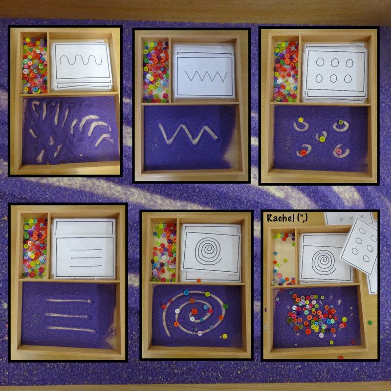
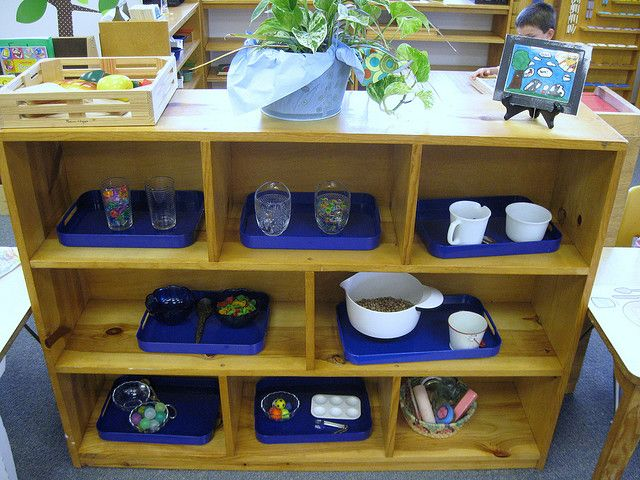
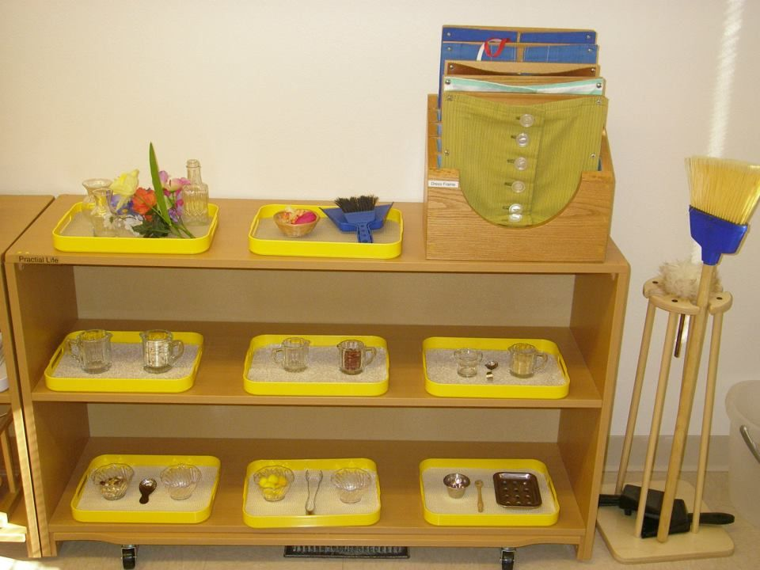

```{r setup, include=FALSE}
knitr::opts_chunk$set(echo = TRUE)
```

`git` and `github` are somewhat hard to grasp by analogy.  This page is a set of attempts to provide analogies for git.  I'm always intersted in collecting more, so post in the Discussion forums if you come across them.

## Git as Montessori Trays

As I understand it, in Montessori classrooms, there are different activities ("materials") for students to engage with. Trays keep materials on hand, organized into sets so that activities can occur, and facilitate easy clean up. So students can move quickly to a new activity, have all the things they need on hand, and return activities to the shelves without needing to dismantle the current state of their activity.







We can think of a git repository like a set of shelves that contain many trays (inside the .git folder), and we can think of the current working folder like a tray we've taken off the shelf to work on.  Each is a full set of files and in a usual project provide things in a form that we can work on (ie the source code, perhaps a build system configuration file, etc).  We can put the tray back onto the shelf at any time.

Of course, being digital, we can put a copy of the tray back on the shelf (using `git commit`), while keeping an active copy off the shelf where we can keep working on it.

We can also have have multiple copies of the whole shelf (with all of the trays ever checked in) in different locations, including on different laptops, different servers, or even different directories on the one laptop.

No analogy is perfect, but this analogy has these strengths:

1. Communicates the idea of swappable working spaces
2. Communicates the idea that we check a space out to get work done (or to play around)
2. Communicates the idea that the repository stores entire copies (not diffs) of the working space at different times in the past.
2. By changing the order in which trays are stored on the shelf one can re-order the history a la `cherry-pick`/`rebase -i`

The analogy is a bit weaker on the specifics:

1. Doesn't help with the idea of `git add` (how can I check in just some of the changes on a tray? It's the whole tray or none ...)
2. Unclear whether classrooms actually encourage students to store their current state of the activity, or whether they reset the activity trays?
2. Doesn't naturally lend itself to branching models (although perhaps trays on different shelves?)
2. Encourages us to think of one child, one tray which is limiting.